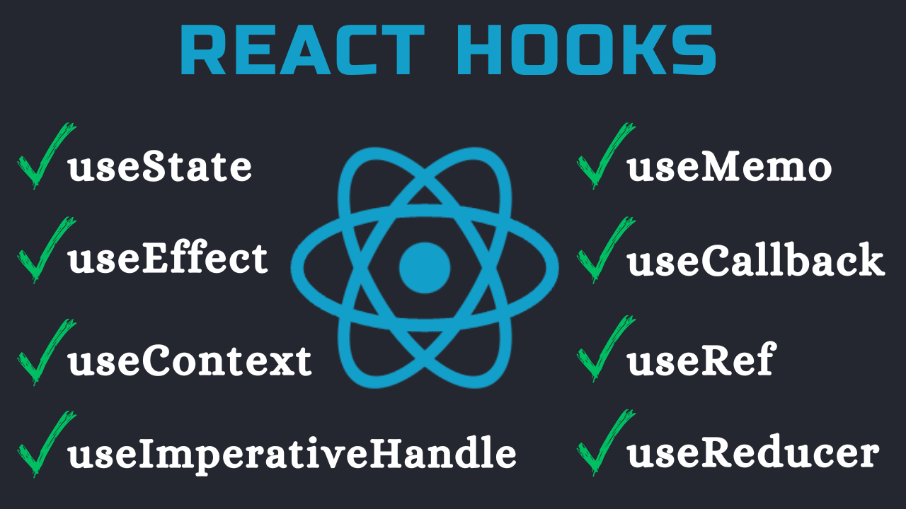

# React Hooks Crash Course

### YouTube Tutorial:

https://youtu.be/UWrSMWI8wbQ

Learn all these react hooks in one video: useState, useEffect, useContext, useMemo, useCallback, useRef, useReducer, useImperativeHandle. We also briefly cover forwardRef and memo.

This is a crash course with quick explanations for each hook.

If you enjoy this tutorial please subscribe, like and share on YouTube.
